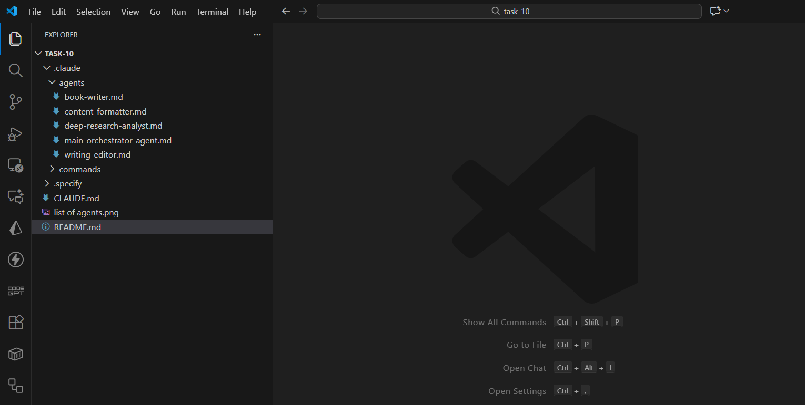

Here is a **clean, well-structured Markdown write-up** for your **30-Days Challenge — Task 10**, describing your Main Orchestrator Agent and the four Sub-Agents you created.
You can paste this directly into your report, GitHub, Notion, or Docusaurus.

---

# 🚀 **30-Days Challenge – Task 10**

## **Building a Multi-Agent Orchestration System for Book Writing**

Today’s task was one of the most important and foundational steps toward building a complete AI-powered book-writing workflow. In **Task-10**, I designed and implemented a **Main Orchestrator Agent** along with **four specialized Sub-Agents**, each responsible for a distinct stage of the book-creation lifecycle.

This system now allows fully autonomous routing of tasks like research, writing, editing, and formatting — all coordinated through a single master agent.

---

## 🧠 **🔹 Main Orchestrator Agent**

The **Main Orchestrator Agent** is the central brain of the workflow.
It receives every command from the user and intelligently decides *which Sub-Agent should handle it* based on intent.

### **Key Capabilities**

* Understands user requests and automatically routes tasks
* Breaks down complex instructions into multiple steps
* Calls appropriate Sub-Agents in sequence (e.g., *Research → Write → Edit → Format*)
* Maintains context, tone, consistency, and style across chapters
* Ensures clean and optimized output with minimal user input

This agent serves as the **manager** of the entire book creation process.

---

# 🧩 **Created Sub-Agents (4 Total)**

Below are the agents created and integrated under the main orchestrator.

---

## 1️⃣ **Research Sub-Agent**

Responsible for deep domain exploration.

### **Functions**

* Topic research
* Concept breakdown
* Trends and frameworks
* Summaries and briefs
* Comparison tables
* Knowledge gap identification

It provides the foundation on which chapters and sections are built.

---

## 2️⃣ **Writing Sub-Agent**

Focused on transforming ideas into well-structured book content.

### **Capabilities**

* Generate book outlines
* Write chapters
* Expand notes into detailed content
* Maintain narrative flow
* Adapt tone (academic, technical, storytelling, etc.)
* Produce clean, structured Markdown

This is the core content generator of the system.

---

## 3️⃣ **Editing Sub-Agent**

Improves and refines written content.

### **Responsibilities**

* Grammar, clarity, and coherence improvement
* Rewrite in a consistent style
* Remove repetition and weak arguments
* Enhance sentence flow
* Fix logic gaps
* Maintain original meaning

This agent ensures the writing is polished and professional.

---

## 4️⃣ **Formatting Sub-Agent**

Ensures the content looks clean and publication-ready.

### **Tasks**

* Convert any text to clean Markdown
* Structure headings, lists, and tables properly
* Make content Docusaurus-friendly
* Improve readability and hierarchy
* Apply consistent formatting conventions

It prepares the final text for deployment or documentation.

---

# 📁 **Project Folder View (VS Explorer Screenshot)**

This screenshot shows the directory structure containing the Main Orchestrator Agent and all four Sub-Agents.

---

# 🧩 **List of Agents via `/agents` Command**

This confirms that all agents were successfully registered and are now available for use.

---

# ✅ **Summary of Task-10 Achievement**

In Task-10, I successfully:

* Created a **Main Orchestrator Agent**
* Built **four modular and specialized Sub-Agents**
* Designed an intelligent routing system
* Established a scalable multi-agent architecture
* Prepared the foundational framework for automated book writing
* Verified agents through VS Code and CLI

This completes a major milestone in my 30-Days Challenge.

---

If you want, I can also generate:

✅ A visual architecture diagram
✅ A workflow diagram (Research → Write → Edit → Format)
✅ A Docusaurus-ready page version
Just tell me!
