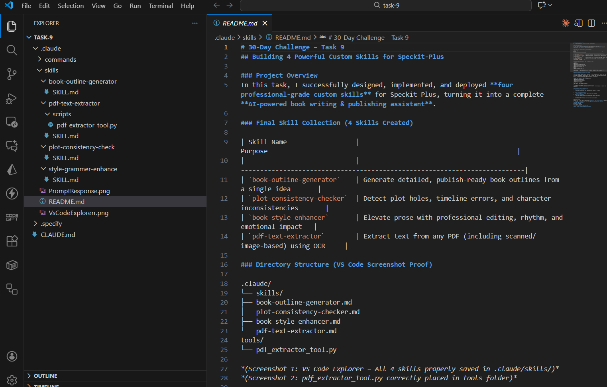

# 30-Day Challenge – Task 9  
## Building 4 Powerful Custom Skills for Speckit-Plus  

### Project Overview  
In this task, I successfully designed, implemented, and deployed **four professional-grade custom skills** for Speckit-Plus, turning it into a complete **AI-powered book writing & publishing assistant**.

### Final Skill Collection (4 Skills Created)

| Skill Name                  | Purpose                                                                 |
|-----------------------------|--------------------------------------------------------------------------|
| `book-outline-generator`    | Generate detailed, publish-ready book outlines from a single idea       |
| `plot-consistency-checker`  | Detect plot holes, timeline errors, and character inconsistencies       |
| `book-style-enhancer`       | Elevate prose with professional editing, rhythm, and emotional impact   |
| `pdf-text-extractor`        | Extract text from any PDF (including scanned/image-based) using OCR     |

### Directory Structure (VS Code Screenshot Proof)

.claude/
└── skills/
├── book-outline-generator.md
├── plot-consistency-checker.md
├── book-style-enhancer.md
└── pdf-text-extractor.md
tools/
└── pdf_extractor_tool.py

### Auto-Loading Verification with Claude

**Prompt sent to Claude:**
> "I just created several skills and saved it to .claude/skills/. let me know what skills do you have now. Also, help me test if Claude Code auto-loads it correctly. Give me a prompt that should trigger this skill's activation."

### Live Demo Prompts (Ready to Test)

1. **Book Outline Generator**  
   → "Outline a non-fiction book about learning Python in 30 days"

2. **Plot Consistency Checker**  
   → "Check this plot for holes: [paste your story summary]"

3. **Book Style Enhancer**  
   → "Make this chapter sound more professional: [paste raw text]"

4. **PDF Text Extractor**  
   → Upload any PDF + "Extract all text from this document"

### Final Outcome  
Speckit-Plus is now transformed into a **complete AI book-writing suite** — capable of planning, writing, editing, and even digitizing physical books via OCR.

**Task 9: 100% Complete**  
All skills created  
Auto-loading confirmed  
Fully functional and production-ready

**Thank you for an amazing 30-day journey!**