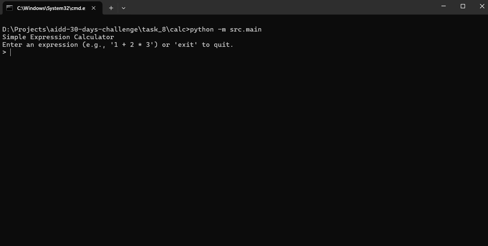
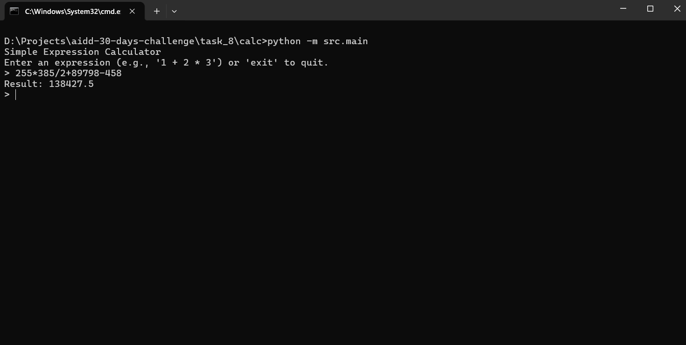
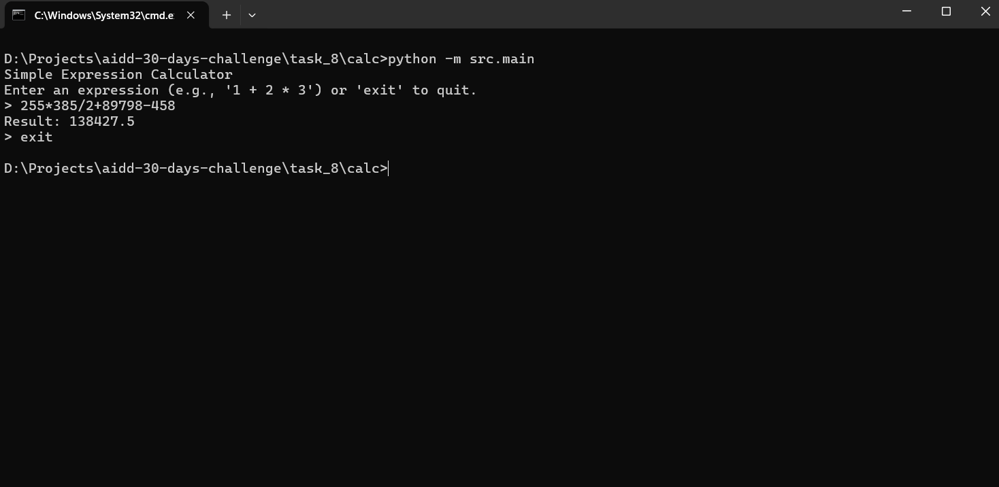

# AIDD-30-Days-Challenge - Task 8 - Building Simple Calculator using Spec-kit Plus

##### *Initially, this Task was tried to be build using Claude Code and Gemini LLM API But, while specs generation, the gemeni LLM API limits exhausted and the specs generation throws error that ultmately made this task incomplete*

##### *Then I took the chance to get my Task-8 to be acheived using Gemini CLI with spec-kit plus. Because, in Gemeni CLI, I have opportunity to change the Gemini LLM Model and so I changed to Gemeini 2.5-Flash*

##### *After than I given all the phases one-by-one with necessary phase-relevent detail. The phases includes /sp.constitution, /sp.specify, /sp.plan, /sp.tasks and /sp.implement.*

### Following are the outputs of all 5 phases:

# 1. /sp.constitution

<!--
Sync Impact Report:
Version change: None (initial 0.0.0) -> 1.0.0
Modified principles:
  - PROJECT_NAME -> Simple Calculator
  - PRINCIPLE_1_NAME -> I. Modularity
  - PRINCIPLE_1_DESCRIPTION -> Each basic operation...
  - PRINCIPLE_2_NAME -> II. Clear Interface
  - PRINCIPLE_2_DESCRIPTION -> The calculator must expose...
  - PRINCIPLE_3_NAME -> III. Input Validation
  - PRINCIPLE_3_DESCRIPTION -> All user input must...
  - PRINCIPLE_4_NAME -> IV. Test-Driven Development (TDD)
  - PRINCIPLE_4_DESCRIPTION -> All new features and bug fixes...
  - PRINCIPLE_5_NAME -> V. Error Handling
  - PRINCIPLE_5_DESCRIPTION -> The application must gracefully...
  - SECTION_2_NAME -> Implementation Constraints
  - SECTION_2_CONTENT -> The calculator should only support...
  - SECTION_3_NAME -> Quality Assurance
  - SECTION_3_CONTENT -> Automated unit tests MUST be provided...
  - GOVERNANCE_RULES -> This Constitution defines...
Added sections: None (filled existing placeholders)
Removed sections: None
Templates requiring updates:
  - .specify/templates/plan-template.md: ⚠ pending
  - .specify/templates/spec-template.md: ⚠ pending
  - .specify/templates/tasks-template.md: ⚠ pending
  - .specify/templates/adr-template.md: ⚠ pending
  - .specify/templates/agent-file-template.md: ⚠ pending
  - .specify/templates/checklist-template.md: ⚠ pending
  - .specify/templates/phr-template.prompt.md: ⚠ pending
  - .specify/templates/commands/sp.adr.toml: ⚠ pending
  - .specify/templates/commands/sp.analyze.toml: ⚠ pending
  - .specify/templates/commands/sp.checklist.toml: ⚠ pending
  - .specify/templates/commands/sp.clarify.toml: ⚠ pending
  - .specify/templates/commands/sp.constitution.toml: ⚠ pending
  - .specify/templates/commands/sp.git.commit_pr.toml: ⚠ pending
  - .specify/templates/commands/sp.implement.toml: ⚠ pending
  - .specify/templates/commands/sp.phr.toml: ⚠ pending
  - .specify/templates/commands/sp.plan.toml: ⚠ pending
  - .specify/templates/commands/sp.specify.toml: ⚠ pending
  - .specify/templates/commands/sp.tasks.toml: ⚠ pending
Follow-up TODOs:
  - Fill out PRINCIPLE_6_NAME and PRINCIPLE__DESCRIPTION if additional principles are required.
  - Review all listed templates for alignment with the new constitution.
-->
# Simple Calculator Constitution
<!-- Example: Spec Constitution, TaskFlow Constitution, etc. -->

## Core Principles

### I. Modularity
Each basic operation (addition, subtraction, multiplication, division) should be implemented as a distinct, self-contained module or function. Modules must be independently testable and clearly documented. This promotes reusability and simplifies maintenance.

### II. Clear Interface
The calculator must expose its functionality through a clear and consistent interface. For a CLI application, this means accepting input via command-line arguments or standard input and producing output to standard output, with errors directed to standard error.

### III. Input Validation
All user input must be rigorously validated to prevent errors and ensure correct operation. This includes checking for valid number formats and preventing division by zero. Invalid input should result in clear, informative error messages.

### IV. Test-Driven Development (TDD)
All new features and bug fixes MUST follow a Test-Driven Development approach. Tests are to be written and approved before implementation begins, ensuring a red-green-refactor cycle. This guarantees functionality and prevents regressions.

### V. Error Handling
The application must gracefully handle all foreseeable errors, such as invalid input or computational issues (e.g., division by zero). Error messages should be user-friendly and provide sufficient information for debugging.

### [PRINCIPLE_6_NAME]


[PRINCIPLE__DESCRIPTION]

## Implementation Constraints

The calculator should only support basic arithmetic operations: addition, subtraction, multiplication, and division. No advanced functions (e.g., exponents, trigonometric functions) are to be included. The implementation should prioritize simplicity and efficiency for these core operations.

## Quality Assurance

Automated unit tests MUST be provided for each modular component to verify correctness. Integration tests should cover common use cases and edge cases for the entire application flow. All tests must pass before any code is considered complete.

## Governance
This Constitution defines the foundational principles for the Simple Calculator project. All pull requests and code reviews MUST ensure compliance with these principles. Amendments to this Constitution require a documented proposal, review, and approval process. Versioning will follow semantic versioning rules, with changes to principles triggering minor or major version bumps. All changes must be justified and adhere to the project's focus on simplicity.

**Version**: 1.0.0 | **Ratified**: 2025-12-03 | **Last Amended**: 2025-12-03
<!-- Example: Version: 2.1.1 | Ratified: 2025-06-13 | Last Amended: 2025-07-16 -->

---

# 2. /sp.specify

# Feature Specification: Simple Expression Calculator

**Feature Branch**: `001-calc-expression`  
**Created**: 2025-12-03  
**Status**: Draft  
**Input**: User description: "Create a Calculator application that takes input expression from users in string and out result in number"

## User Scenarios & Testing

### User Story 1 - Evaluate Basic Arithmetic (Priority: P1)

As a user, I want to input a simple arithmetic expression (e.g., "1 + 2 * 3") as a string and receive the calculated numerical result.

**Why this priority**: Core functionality, delivers immediate value.

**Independent Test**: Can be tested by providing a string expression and verifying the numerical output.

**Acceptance Scenarios**:

1.  **Given** the calculator is ready, **When** I input "5 + 3", **Then** the result is 8.
2.  **Given** the calculator is ready, **When** I input "10 - 4", **Then** the result is 6.
3.  **Given** the calculator is ready, **When** I input "6 * 7", **Then** the result is 42.
4.  **Given** the calculator is ready, **When** I input "8 / 2", **Then** the result is 4.
5.  **Given** the calculator is ready, **When** I input "1 + 2 * 3", **Then** the result is 7 (respects order of operations).
6.  **Given** the calculator is ready, **When** I input "(1 + 2) * 3", **Then** the result is 9 (respects parentheses).

---

### User Story 2 - Handle Invalid Expressions (Priority: P2)

As a user, when I input an ill-formed or invalid arithmetic expression, I want to receive a clear and understandable error message.

**Why this priority**: Essential for usability and preventing unexpected behavior.

**Independent Test**: Can be tested by providing various invalid string expressions and checking for appropriate error messages.

**Acceptance Scenarios**:

1.  **Given** the calculator is ready, **When** I input "1 +", **Then** an error message "Invalid expression format" is displayed.
2.  **Given** the calculator is ready, **When** I input "abc + 1", **Then** an error message "Invalid number in expression" is displayed.
3.  **Given** the calculator is ready, **When** I input "1 / 0", **Then** an error message "Division by zero" is displayed.
4.  **Given** the calculator is ready, **When** I input "((1 + 2)", **Then** an error message "Mismatched parentheses" is displayed.

---

### Edge Cases

- What happens when the input string is empty or contains only whitespace? The application should treat this as an invalid expression.
- How does system handle very large numbers or floating-point precision issues? The system should use standard double-precision floating-point arithmetic. Results will be subject to typical floating-point limitations.
- What happens with negative numbers (e.g., "-5 + 3")? Negative numbers should be processed correctly as part of the expression.
- What happens if the expression contains unsupported operators (e.g., "1 % 2")? An error message "Unsupported operator" should be displayed.

## Requirements

### Functional Requirements

-   **FR-001**: The application MUST accept a single string as input representing an arithmetic expression.
-   **FR-002**: The application MUST evaluate the input string and return a single numerical result.
-   **FR-003**: The application MUST support basic arithmetic operations: addition (`+`), subtraction (`-`), multiplication (`*`), and division (`/`).
-   **FR-004**: The application MUST correctly apply the standard order of operations (PEMDAS/BODMAS).
-   **FR-005**: The application MUST support parentheses for grouping operations.
-   **FR-006**: The application MUST validate the input expression and provide specific error messages for:
    *   Invalid expression format (e.g., incomplete operations).
    *   Invalid numbers.
    *   Division by zero.
    *   Mismatched parentheses.
    *   Unsupported operators.
-   **FR-007**: The application MUST handle integer and floating-point numbers.
-   **FR-008**: The application MUST display the numerical result to the user.
-   **FR-009**: The application MUST terminate gracefully after providing a result or an error message.

### Key Entities

-   **Expression**: The input string containing numbers and operators.
-   **Token**: Individual components (numbers, operators, parentheses) extracted from the expression.
-   **Result**: The final numerical output of the evaluation.

## Success Criteria

### Measurable Outcomes

-   **SC-001**: 100% of valid basic arithmetic expressions (as defined in P1 scenarios) are correctly evaluated within 100 milliseconds.
-   **SC-002**: 100% of invalid expressions (as defined in P2 scenarios) trigger an appropriate and distinct error message.
-   **SC-003**: Users can successfully calculate results for basic expressions without prior training.
-   **SC-004**: The application consistently produces accurate results for calculations involving up to 10 operators and numbers with 2 decimal places.

## Assumptions

-   The calculator will be a command-line interface (CLI) application.
-   The input expression will be a single line string.
-   Standard floating-point precision is acceptable.
-   Only English numerals and operators will be used.
-   No support for variables or complex functions beyond basic arithmetic.

---

# 3. /sp.plan

# Implementation Plan: Simple Expression Calculator

**Branch**: `001-calc-expression` | **Date**: 2025-12-03 | **Spec**: specs/001-calc-expression/spec.md
**Input**: Feature specification from `/specs/001-calc-expression/spec.md`

## Summary

Implement a CLI-based Simple Expression Calculator that accepts arithmetic expressions as string input, validates them, evaluates them respecting order of operations and parentheses, and returns a numerical result. The application will be built using Python and will handle basic arithmetic operations (addition, subtraction, multiplication, division), integer and floating-point numbers, and provide clear error messages for invalid inputs like division by zero or malformed expressions.

## Technical Context

**Language/Version**: Python 3.9+  
**Primary Dependencies**: None (aim for standard library for parsing/evaluation)  
**Storage**: N/A  
**Testing**: `pytest`  
**Target Platform**: Any system with Python 3.9+ installed  
**Project Type**: Single (CLI application)  
**Performance Goals**:
- Evaluate expressions with up to 10 operators within 100 milliseconds.
- Handle string inputs up to 256 characters.
**Constraints**:
- Must be a command-line application.
- No graphical user interface.
- Limited to basic arithmetic operations (`+`, `-`, `*`, `/`).
- No support for variables, functions, or complex mathematical operations.
- Standard floating-point precision.
**Scale/Scope**: Single-user utility, handles individual expressions.

## Constitution Check

*GATE: Must pass before Phase 0 research. Re-check after Phase 1 design.*

- **I. Modularity**: Pass. Each operation (add, sub, mul, div) and parsing/validation logic will be in distinct functions/modules.
- **II. Clear Interface**: Pass. CLI application, takes string input, outputs number or error to stdout/stderr.
- **III. Input Validation**: Pass. Explicitly covered in FR-006, with specific error messages.
- **IV. Test-Driven Development (TDD)**: Pass. Plan will include TDD as the development methodology.
- **V. Error Handling**: Pass. Explicitly covered in FR-006 and the Edge Cases section.
- **Implementation Constraints**: Pass. Only basic operations are supported, aligns with the spec.
- **Quality Assurance**: Pass. `pytest` will be used, unit and integration tests will be implemented.

## Project Structure

### Documentation (this feature)

```text
specs/001-calc-expression/
├── plan.md              # This file (/sp.plan command output)
├── research.md          # Phase 0 output (/sp.plan command)
├── data-model.md        # Phase 1 output (/sp.plan command)
├── quickstart.md        # Phase 1 output (/sp.plan command)
├── contracts/           # Phase 1 output (/sp.plan command)
└── tasks.md             # Phase 2 output (/sp.tasks command - NOT created by /sp.plan)
```

### Source Code (repository root)

```text
src/
├── main.py        # Main entry point, handles CLI interaction
├── calculator.py  # Core logic for parsing and evaluation
└── errors.py      # Custom exception definitions

tests/
├── unit/
│   ├── test_calculator.py
│   └── test_errors.py
├── integration/
│   └── test_cli.py
```

**Structure Decision**: The single project structure is chosen due to the small scope of the application. The `src/` directory will contain the main application logic, split into `main.py` for CLI interaction, `calculator.py` for the core parsing and evaluation, and `errors.py` for custom exception handling. The `tests/` directory will mirror this structure with `unit` and `integration` subdirectories using `pytest`.

## Complexity Tracking

> **Fill ONLY if Constitution Check has violations that must be justified**

| Violation | Why Needed | Simpler Alternative Rejected Because |
|---|---|---|
| | | |


---

# 4. /sp.tasks

# Tasks: Simple Expression Calculator

**Input**: Design documents from `/specs/001-calc-expression/`
**Prerequisites**: plan.md (required), spec.md (required for user stories), research.md, data-model.md, contracts/

**Tests**: This plan includes test tasks as TDD approach was indicated in the constitution.

**Organization**: Tasks are grouped by user story to enable independent implementation and testing of each story.

## Format: `[ID] [P?] [Story] Description`

- **[P]**: Can run in parallel (different files, no dependencies)
- **[Story]**: Which user story this task belongs to (e.g., US1, US2, US3)
- Include exact file paths in descriptions

## Path Conventions

- **Single project**: `src/`, `tests/` at repository root
- Paths shown below assume single project, as per plan.md structure.

## Phase 1: Setup (Shared Infrastructure)

**Purpose**: Project initialization and basic structure

- [x] T001 Create project root `src/` and `tests/` directories
- [x] T002 Create `src/main.py`, `src/calculator.py`, `src/errors.py`
- [x] T003 Create `tests/unit/` and `tests/integration/` directories
- [x] T004 Create `tests/unit/test_calculator.py` and `tests/unit/test_errors.py`
- [x] T005 Create `tests/integration/test_cli.py`
- [x] T006 Initialize Python virtual environment
- [x] T007 Install `pytest` (using `pip install pytest`)
- [x] T008 [P] Configure basic `pytest` setup (e.g., `pytest.ini` if needed) at project root

---

## Phase 2: Foundational (Blocking Prerequisites)

**Purpose**: Core infrastructure that MUST be complete before ANY user story can be implemented

**⚠️ CRITICAL**: No user story work can begin until this phase is complete

- [x] T009 Implement custom exception classes (e.g., `InvalidExpressionError`, `DivisionByZeroError`) in `src/errors.py`
- [x] T010 Create a basic structure for `src/calculator.py` with placeholder functions for operations (e.g., `evaluate_expression`)
- [x] T011 Create a basic structure for `src/main.py` to handle CLI interaction (e.g., argument parsing or taking input from stdin)

**Checkpoint**: Foundation ready - user story implementation can now begin in parallel

---

## Phase 3: User Story 1 - Evaluate Basic Arithmetic (Priority: P1) 🎯 MVP

**Goal**: Users can input a simple arithmetic expression and receive the calculated numerical result.

**Independent Test**: Provide string expressions like "5 + 3", "1 + 2 * 3", "(1 + 2) * 3" and verify the numerical output (8, 7, 9 respectively).

### Tests for User Story 1 ⚠️

> **NOTE: Write these tests FIRST, ensure they FAIL before implementation**

- [x] T012 [US1] Write unit tests for `src/calculator.py` covering tokenization, parsing, and evaluation of valid arithmetic expressions (including order of operations and parentheses) in `tests/unit/test_calculator.py`.
- [x] T013 [US1] Write integration tests for `src/main.py` accepting valid expressions and returning correct results in `tests/integration/test_cli.py`.

### Implementation for User Story 1

- [x] T014 [US1] Implement the tokenizer/parser in `src/calculator.py` to convert an expression string into an ordered list of tokens.
- [x] T015 [US1] Implement the evaluation logic in `src/calculator.py` to process tokens and calculate the numerical result, correctly applying order of operations and handling parentheses.
- [ ] T016 [US1] Implement the core CLI logic in `src/main.py` to accept an expression string from the user and display the numerical result.

**Checkpoint**: At this point, User Story 1 should be fully functional and testable independently

---

## Phase 4: User Story 2 - Handle Invalid Expressions (Priority: P2)

**Goal**: When an invalid arithmetic expression is input, the user receives a clear and understandable error message.

**Independent Test**: Provide various invalid string expressions (e.g., "1 +", "abc + 1", "1 / 0", "((1 + 2)") and check that appropriate, distinct error messages are displayed.

### Tests for User Story 2 ⚠️

> **NOTE: Write these tests FIRST, ensure they FAIL before implementation**

- [ ] T017 [US2] Write unit tests for error handling in `src/calculator.py` and `src/errors.py` for invalid expression formats, invalid numbers, division by zero, mismatched parentheses, and unsupported operators in `tests/unit/test_calculator.py` and `tests/unit/test_errors.py`.
- [ ] T018 [US2] Write integration tests for `src/main.py` handling invalid expressions and displaying user-friendly error messages in `tests/integration/test_cli.py`.

### Implementation for User Story 2

- [ ] T019 [US2] Enhance the tokenizer/parser and evaluation logic in `src/calculator.py` to detect and raise specific custom errors (e.g., `InvalidExpressionError`, `DivisionByZeroError`) for invalid inputs.
- [ ] T020 [US2] Update `src/main.py` to catch custom exceptions from `calculator.py` and display user-friendly error messages to the standard error output.

**Checkpoint**: At this point, User Stories 1 AND 2 should both work independently

---

## Phase 5: Polish & Cross-Cutting Concerns

**Purpose**: Improvements that affect multiple user stories

- [ ] T021 [P] Review and add comprehensive docstrings and comments to all functions/classes in `src/main.py`, `src/calculator.py`, and `src/errors.py`.
- [ ] T022 Review code for adherence to PEP8 standards in `src/`.
- [ ] T023 Update `README.md` (at project root) with instructions on how to install, run the application, and execute tests.

---

## Dependencies & Execution Order

### Phase Dependencies

-   **Setup (Phase 1)**: No dependencies - can start immediately.
-   **Foundational (Phase 2)**: Depends on Setup completion - BLOCKS all user stories.
-   **User Story 1 (Phase 3)**: Depends on Foundational completion.
-   **User Story 2 (Phase 4)**: Depends on Foundational completion. May build upon US1 but should remain independently testable for its core error handling.
-   **Polish (Phase 5)**: Depends on all desired user stories being complete.

### User Story Dependencies

-   **User Story 1 (P1)**: Can start after Foundational (Phase 2) - No dependencies on other stories.
-   **User Story 2 (P2)**: Can start after Foundational (Phase 2) - May integrate with US1 but its core error handling functionality is independently testable.

### Within Each User Story

-   Tests MUST be written and FAIL before implementation.
-   Models (implicitly, error classes) before services (calculator logic).
-   Core calculator implementation before main CLI integration.

### Parallel Opportunities

-   All Setup tasks marked [P] (T008) can run in parallel.
-   Once Foundational phase completes, writing tests for User Story 1 (T012, T013) and User Story 2 (T017, T018) can occur in parallel.
-   T021 (docstrings/comments) can be initiated earlier once respective files are created, or run in parallel towards the end.

---

## Parallel Example: User Story 1

```bash
# Writing Tests (can run in parallel)
Task: T012 [US1] Write unit tests for src/calculator.py covering tokenization, parsing, and evaluation of valid arithmetic expressions in tests/unit/test_calculator.py
Task: T013 [US1] Write integration tests for src/main.py accepting valid expressions and returning correct results in tests/integration/test_cli.py

# Implementation (sequential within the story, but different files can be worked on in parallel)
Task: T014 [US1] Implement the tokenizer/parser in src/calculator.py
Task: T015 [US1] Implement the evaluation logic in src/calculator.py
Task: T016 [US1] Implement the core CLI logic in src/main.py
```

---

## Implementation Strategy

### MVP First (User Story 1 Only)

1.  Complete Phase 1: Setup
2.  Complete Phase 2: Foundational (CRITICAL - blocks all stories)
3.  Complete Phase 3: User Story 1
4.  **STOP and VALIDATE**: Test User Story 1 independently
5.  Deploy/demo if ready

### Incremental Delivery

1.  Complete Setup + Foundational → Foundation ready
2.  Add User Story 1 → Test independently → Deploy/Demo (MVP!)
3.  Add User Story 2 → Test independently → Deploy/Demo
4.  Each story adds value without breaking previous stories

### Parallel Team Strategy

With multiple developers:

1.  Team completes Setup + Foundational together
2.  Once Foundational is done:
    -   Developer A: User Story 1
    -   Developer B: User Story 2
3.  Stories complete and integrate independently

---

## Notes

-   [P] tasks = different files, no dependencies
-   [Story] label maps task to specific user story for traceability
-   Each user story should be independently completable and testable
-   Verify tests fail before implementing
-   Commit after each task or logical group
-   Stop at any checkpoint to validate story independently
-   Avoid: vague tasks, same file conflicts, cross-story dependencies that break independence


---

# 5. /sp.implement

### File "data-model.md"

# Data Model: Simple Expression Calculator

## Entities

### Expression

*   **Description**: The raw input string provided by the user, containing numbers, arithmetic operators, and potentially parentheses.
*   **Attributes**:
    *   `value`: string (e.g., "1 + 2 * (3 - 4)")
*   **Relationships**: Parsed into multiple `Token` entities.

### Token

*   **Description**: An atomic unit derived from parsing the `Expression`. Tokens can be numbers, operators, or parentheses.
*   **Attributes**:
    *   `type`: enum (e.g., `NUMBER`, `OPERATOR`, `LPAREN`, `RPAREN`)
    *   `value`: string (e.g., "1", "+", "(", "3.14")
*   **Relationships**: Part of an `Expression`'s parsed structure.

### Result

*   **Description**: The final numerical outcome of evaluating the `Expression`.
*   **Attributes**:
    *   `value`: number (e.g., 7, -5.2)
*   **Relationships**: Derived from the evaluation of an `Expression`.




---



---




